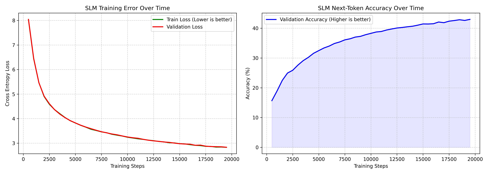

# Small Language Model (SLM) from Scratch

Welcome to your custom Small Language Model! This project is a fully-modular, production-ready extraction of a Transformer neural network pipeline. It is specifically designed and hyper-parameter optimized to train successfully on consumer hardware like an NVIDIA GTX 1650 (4GB VRAM) without crashing.

## Project Structure

The files are designed to be understood and executed in the following chronological sequence:

1. **`config.py`** - The Control Panel. Contains all hyperparameters (learning rates, context window limits, and VRAM optimization settings).
2. **`data.py`** - The Data Pipeline. Downloads English stories, translates them into mathematical token IDs, and saves them to hard drive chunks (`data/*.bin` files) to save RAM and keep the root directory perfectly clean.
3. **`model.py`** - The Brain. Contains the raw PyTorch mathematics of the Transformer architecture (Flash Attention, Multi-Layer Perceptrons, etc).
4. **`train.py`** - The Engine. Runs the PyTorch training loop across mini-batches, handles gradient accumulation for 4GB VRAM, and auto-saves the smartest model weights.
5. **`visualize.py`** - The Dashboard. Reads the output logs from training and graphs the AI's learning progress (Loss & Accuracy).
6. **`generate.py`** - The Interface. Loads up your fully-trained brain from the `models/` folder and lets you chat with it.

---

## Step-by-Step Setup Guide

### Step 1: Install Dependencies
Open your terminal in this folder and install the required libraries. The `requirements.txt` file is specially configured to grab the CUDA (GPU-accelerated) version of PyTorch.

```bash
pip install -r requirements.txt
```

### Step 2: Prepare the Dataset
We are going to train the AI on the HuggingFace "TinyStories" dataset (stories simple enough for a 3-year-old child).

Run the data script:
```bash
python data.py
```
*Note: This will download text from the internet, create a `data/` folder, and convert them into two large `.bin` files on your hard drive. This can take a few minutes.*

### Step 3: Train the Model!
Once the `data/` folder contains your `.bin` files, kick off the training loop.

```bash
python train.py
```
*Note: As soon as you run this, a massive dashboard will print in your terminal showing your GPU, your batch sizes, and your parameter count. The script will automatically save the best-performing weights into a new `models/` folder.*

### Step 4: Visualize Progress
While `train.py` is running (open a new terminal window) OR after it finishes, you can check how smart the model is getting:

```bash
python visualize.py
```
*Note: This will pop up a window with two graphs showing the Cross-Entropy Loss dropping and the Next-Token Accuracy rising.*

### Step 5: Talk to the AI
Once you are satisfied with the training and have a `.pt` file generated inside the `models/` folder, you can test it!

```bash
python generate.py
```
*Note: The script will prompt you to type in a few words (e.g., "A little girl went"). The AI will read your prompt and generate the rest of the story! Type 'exit' to quit.*

---

## Training Results & Performance

After training for 20,000 steps (approx. 1.5 hours on an NVIDIA GTX 1650), the 49-Million Parameter model achieved the following performance on the TinyStories validation set:

- **Validation Loss:** `2.83`
- **Next-Token Accuracy:** `~43%`

### Training Graphs

*(The model successfully decreases its Cross-Entropy Loss over time while increasing its ability to guess the exact next word of unseen stories).*

### Generation Example
Even at 43% accuracy, the SLM is capable of generating fully coherent, grammatically correct English stories based on the dataset vocabulary.

**User Prompt:** *"a little boy"*

**AI Generated Response:**
> "The boy was very excited, now he knew he had done something special. The little boy was so excited! He was so excited that he had to make it find.
> When he got to the boy, he asked the boy, 'What are you for your way to play in the woods? Maybe you can use it to find it!'
> The little boy was very excited and he smiled at the small boy. He asked the boy why he couldn't find it. The boy looked at the little boy and said, 'It's time to go home soon!'
> The boy smiled and said, 'Yes, it's so good to get to the little girl!' The little boy smiled and said, 'Of course'"
